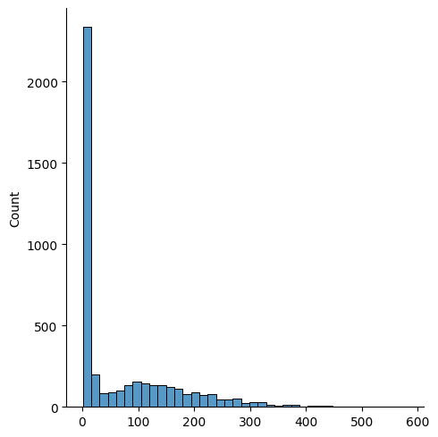
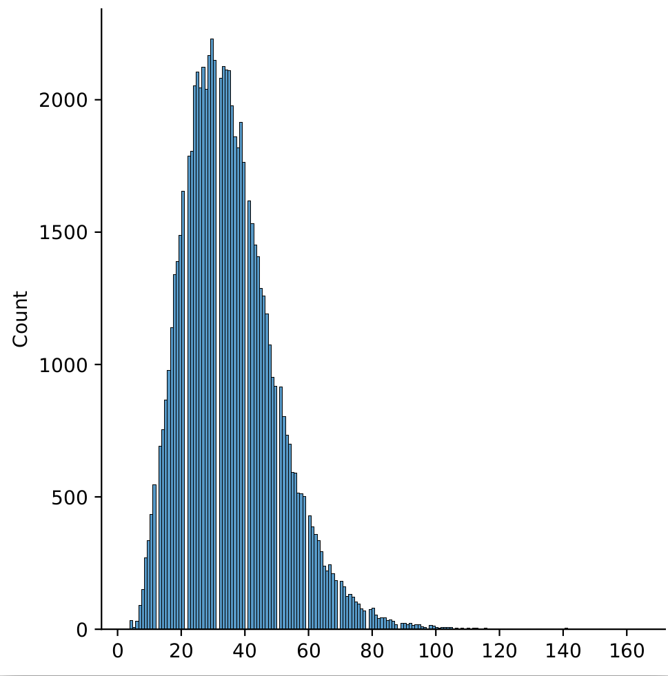

# 🤔 ppllm
Blazing-Fast Python Library to Compute LLM's Perplexity and Surprisal

## Features
### Windowed PPL
Because Transformers have a quadratic complexity 
([Vaswani et al., 2017](https://proceedings.neurips.cc/paper_files/paper/2017/hash/3f5ee243547dee91fbd053c1c4a845aa-Abstract.html),
[Tay et al., 2023](https://doi.org/10.1145/3530811)),
computing the PPL of long texts is expensive.
Windowed PPL restrains the context size to a fixed window as illustrated below (e.g. of 64 tokens, so the quadratic complexity is not so bad)

#### Without window (context size may get long)


#### With window (fixed context size)


In practice, 🤔 ppllm uses a stride of half the window size, instead of the unit stride illustrated here 
(which would require as many forward passes as the number of tokens in the sequence, which would defeat the purpose)

(Illustration by https://huggingface.co/docs/transformers/perplexity)

## Installation
TODO

## Usage
### CLI
```bash
python -m ppllm /path/to/output /path/to/data --model_kwargs.pretrained_model_name_or_path=meta-llama/Llama-3.1-8B --window=64
```

Omit `--window` to compute PPL with the entire context

Use `python -m ppllm -h` to see all arguments

## Benchmark

Setup: 
- NVIDIA V100 (32GB)
- Llama-3.1-8B

### wikitext-2-v1

software | throughput in seconds
-----------|------
vllm | 328
transformers sorted v2 b4bf445eb46c2d73439a5046540e6649bd86f368 | 79
transformers sorted v2 window=128 b4bf445eb46c2d73439a5046540e6649bd86f368 | 108

It seems that the sequences are too short to take advantage of windowed PPL and that sorting the text by length is enough 
(to get rid of the long tail/inefficient padding)



### 23k english sentences from EuroParl

software | throughput in seconds
-----------|------
vllm | TODO
transformers naive v1 a2e221a3bb64d7d1a8b0c9de149ea39e7371f3fc | 328
transformers sorted v2 007adde493d98c185870b4743495e9e2ae03fa5d | 222
transformers sorted v2 window=64 007adde493d98c185870b4743495e9e2ae03fa5d | 234

transformers static batch size (higher gets OOM): 32 

#### Length distribution
It seems that the sequences are too short to take advantage of windowed PPL and that sorting the text by length is enough 
(to get rid of the long tail/inefficient padding)



### 500k multilingual sentences from Parlamint
both vllm and transformers (naive v1) get OOM, even with a batch size of 1, even when scaling to H100

Windowed PPL should fix it (TODO)
